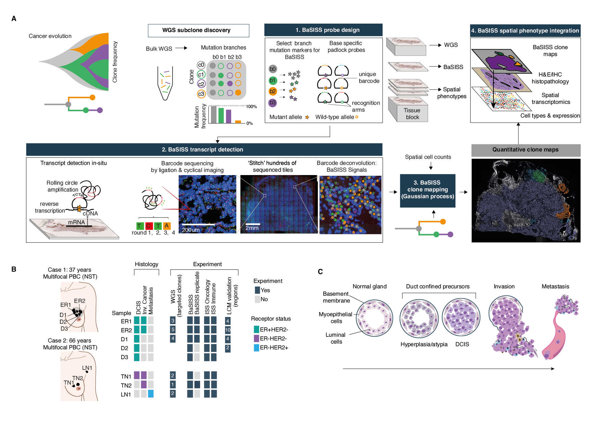
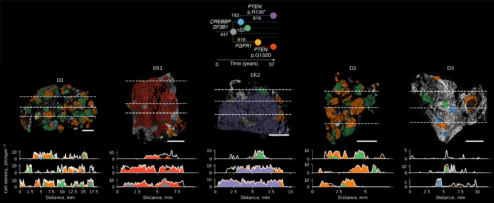
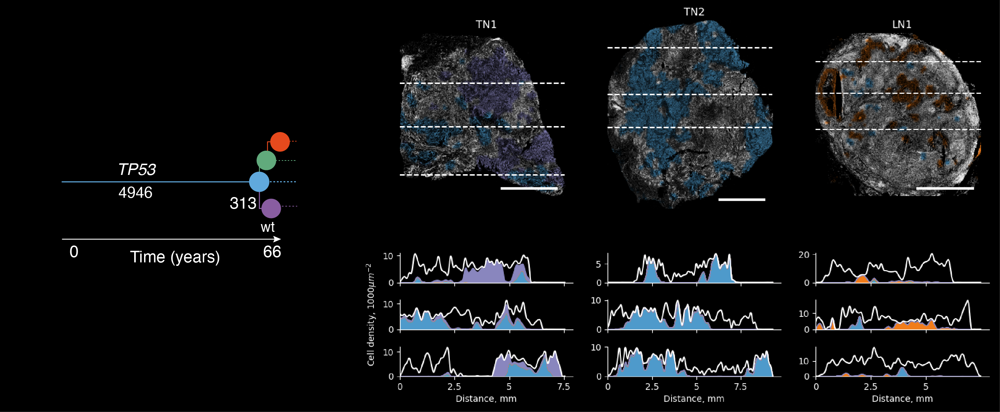

# Spatial genomics maps the structure, character and evolution of cancer clones 

This repository contains code that was used to analyse Base Specific In Situ Sequencing (BaSISS) data, observe coexisting cancer clones and describe their distinctive immunological and phenotypic properties.

# Installation
After cloning the repository with
```
git clone git@github.com:gerstung-lab/BaSISS.git
```
Create a new conda environment with all the necessary packages installed
```
conda env create -f environment.yml
conda activate basiss
```
If you want to run the complete analysis yourself, please request the raw data by writing to the email - alomakin@ebi.ac.uk. We are happy to share it, the approximate size of the raw data is 60GB 

# Interactive maps
An interactive viewer of the generated data and inferred clone maps is accessible at https://www.cancerclonemaps.org/
# Notebooks
All the essential steps for BaSISS analysis are shown in the example notebooks
## Preprocessing
#### <a href="https://github.com/gerstung-lab/BaSISS/blob/main/notebooks/Data_preparation.ipynb"> Data preparation</a>
The experimental data consists of several layers of information, the main parts are 1) BaSISS or ISS singles, 2) Background tissue image (DAPI) and 3) Selected regions of interest. To make the downstream analysis easier we store these layers in a single `basiss.preprocessing.Sample` object.
#### <a href="https://github.com/gerstung-lab/BaSISS/blob/main/notebooks/sc_spatial_typing.ipynb">Single cell spatial typing</a>
*In-situ* sequencing signals do not directly reveal which cell they are derived from. This makes downstream analysis limited, since differential expression
analysis is ambiguous: the same changes could be observed due to a change in expression programs of due to a local cell composition change. In this notebook we assign ISS signals to nuclei and conduct cell type assignment based on the selected marker genes with `basiss.sc_annot.iss_annotation` function.
## Clone maps inference
The main novelty of the experimental approach is the ability to trace multiple cancer lineage specific alleles in space. However, the direct interpretation of their spatial pattern is difficult and require a further deconvolution step. In this section, we generate continuous spatial clone maps using a statistical algorithm that exploits BaSISS signals as well as local cell counts (derived from the DAPI channel during the fluorescence microscopy of BaSISS) using two-dimensional Gaussian processes. The variational Bayesian model also accounts for unspecific or wrongly decoded signals and variable probe efficiency and is augmented by variant allele fractions in the bulk genomic sequencing data.
#### <a href="https://github.com/gerstung-lab/BaSISS/blob/main/notebooks/PD9694_main_analysis.ipynb">PD9694 main analysis</a>
Clone mapping in case 1 (PD9694) which includes two oestrogen receptor (ER) positive invasive
primary breast cancers (ER1 and ER2, or PD9694a and PD9694c), and three samples with ductal carcinoma in situ (D1, D2 and D3, or PD9694d, PD9694l, PD9694m). In addition, samples D1, ER1 and ER2 had a technical replicas (consecutive slides), to serve as a validation.



#### <a href="https://github.com/gerstung-lab/BaSISS/blob/main/notebooks/PD14780_main_analysis.ipynb">PD14780 main analysis</a>
Clone mapping in case 2 (PD14780) which includes two ER negative
invasive breast cancers (TN1 and TN2, or PD14780a and PD14780d) and a draining axillary lymph node that contains metastatic cells (LN1 or PD14780e).



## Raw signal exploration and LCM Validation
#### <a href="https://github.com/gerstung-lab/BaSISS/blob/main/notebooks/BaSISS_spatial_signal_analysis.ipynb">Spatial signal analysis</a>
In this section we show that:
1. Raw signal distribution is, although noisy, make sense as they replicate the nested structure of clonal evolution (Data makes sense)
2. Laser capture microscopy validate inferred clonal composition (Model works correctly)
3. BaSISS and ISS signals correlate with bulk-WGS and bulk-RNA respectively, validating the panel of selected genes

## Clone composition analysis
After performing spatial lineage tracing of cancer clones, we integrate genetic clone maps with multimodal spatial data
layers, such as histology, expression and cell composition. We find that genetically similar regions can be
scattered across wide areas yet maintain similar transcriptional and histological features and foster recurrent
ecosystems.

In addition, we find that genetic progression, which encapsulates the historical order of events,
does not necessarily translate faithfully to transitions in histological state that are commonly assumed to
reflect the stages of cancer progression. For example genetically similar clones could exist in both pre-invasive and invasive stages.
#### <a href="https://github.com/gerstung-lab/BaSISS/blob/main/notebooks/Clones_characterisation.ipynb">Clone specific phenotype and environment analysis</a>
In this notebook we combine multiple level of information obtained previously, such as histology, cell composition,
cell type specific expression and genetic maps in a `basiss.histology.Histogenomic_associations`. Then we 
construct input data for differential composition and expression analysis and display the results of phenotype-genotype association.
#### <a href="https://github.com/gerstung-lab/BaSISS/blob/main/notebooks/glmm_run.ipynb">GLMM for differential composition and expression</a>
Clone associated environment composition and expression data modeled with Generalised Linear Mixture Models. Modelling results are then passed back to the
**<a href="https://github.com/gerstung-lab/BaSISS/blob/main/notebooks/Clones_characterisation.ipynb">Clone specific phenotype and environment analysis</a>** notebook.
To run this notebook `numpyro` should be installed with `pip install numpyro`.

## Citation
Spatial genomics maps the structure, character and evolution of cancer clones

Artem Lomakin, Jessica Svedlund, Carina Strell, Milana Gataric, Artem Shmatko, Jun Sung Park, Young Seok Ju, Stefan Dentro, Vitalii Kleshchevnikov, Vasyl Vaskivskyi, Tong Li, Omer Ali Bayraktar, Luiza Moore, Sarah Pinder, Andrea L Richardson, Peter J Campbell, Moritz Gerstung, Mats Nilsson, Lucy R Yates

bioRxiv 2021.04.16.439912; doi: https://doi.org/10.1101/2021.04.16.439912

Recent contributors: <a href="https://github.com/rukhovich">Gleb Rukhovich</a> (webtool interface), Sandro Santagata and Hege Russnes (histopathological expertise)
